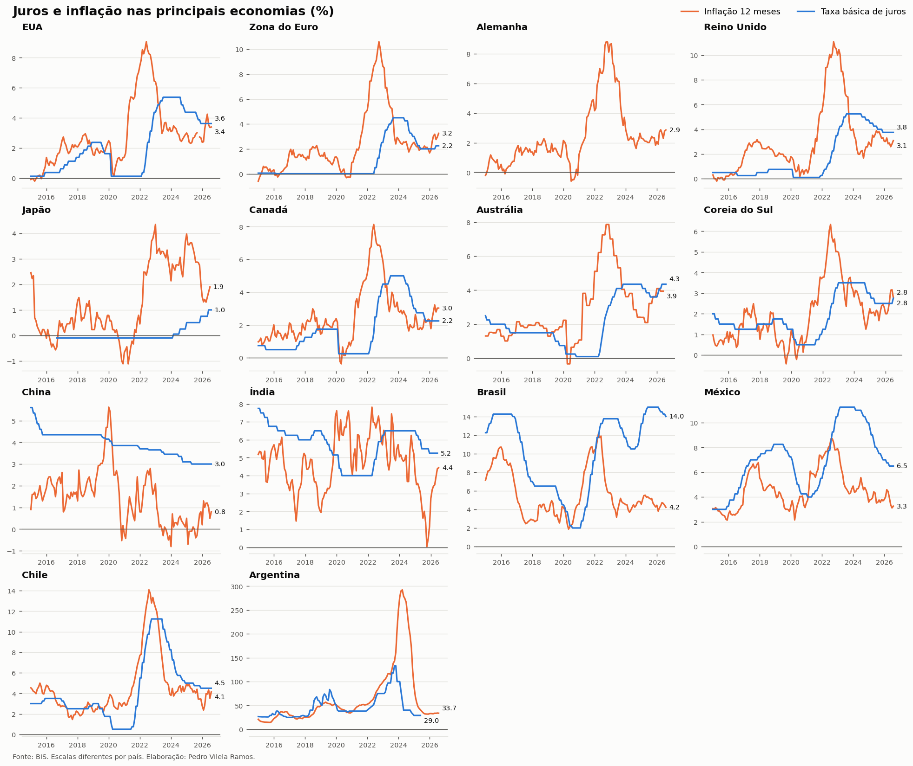
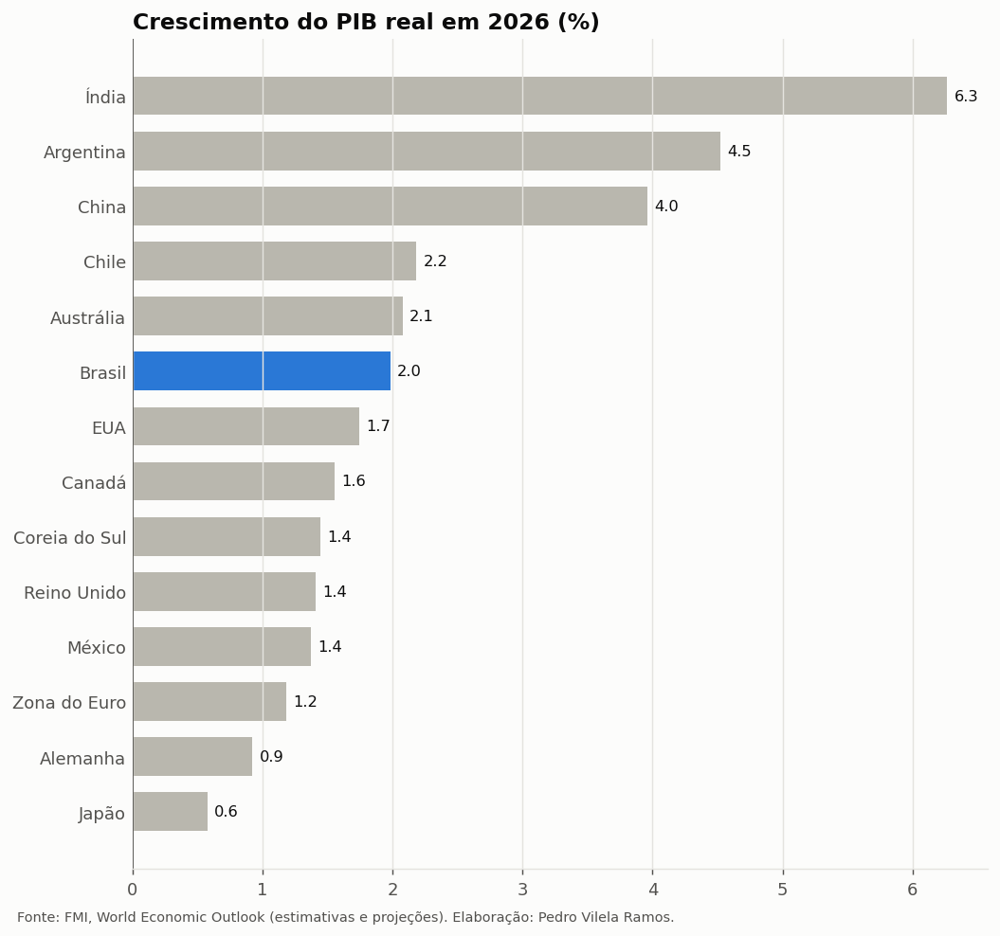
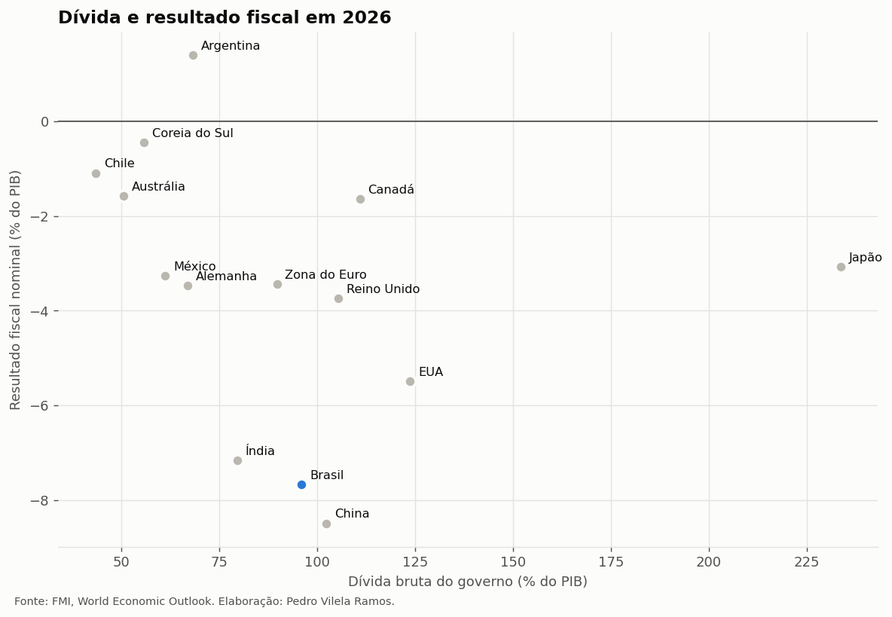

# Economias globais

Painel comparativo das principais economias do mundo: **crescimento, inflação,
juros, desemprego, contas externas e contas públicas**, com dados do FMI e do
BIS e atualização automática todo mês.

🌐 **Painel interativo: [pvilelaramos.github.io/economias-globais](https://pvilelaramos.github.io/economias-globais/)**

## Visão geral

<!-- TABELA:INICIO -->
<!-- TABELA:FIM -->



<p>
  
  
</p>

## Países

**Avançadas:** EUA, Zona do Euro, Alemanha, Reino Unido, Japão, Canadá, Austrália, Coreia do Sul
**Emergentes:** China, Índia, Brasil, México, Chile, Argentina

## Dados

| Indicador | Frequência | Fonte |
|---|---|---|
| Crescimento do PIB real, inflação média, desemprego | Anual, com projeções | FMI, *World Economic Outlook* (API DataMapper) |
| Conta corrente, resultado fiscal e dívida bruta (% do PIB) | Anual, com projeções | FMI, *World Economic Outlook* |
| PIB em US$ e PIB per capita em PPC | Anual, com projeções | FMI, *World Economic Outlook* |
| Taxa básica de juros | Mensal | BIS, *Central bank policy rates* |
| Inflação ao consumidor em 12 meses | Mensal | BIS, *Consumer prices* |

O FMI revisa as projeções duas vezes por ano (abril e outubro), e os dados
mensais do BIS chegam com defasagem de algumas semanas.

## Como rodar

```bash
pip install -r requirements.txt
python src/atualizar.py            # baixa tudo e atualiza gráficos, tabela e site
python src/atualizar.py --offline  # reusa os CSVs de data/processado
python -m pytest tests/
```

O GitHub Actions ([`.github/workflows/atualizar.yml`](.github/workflows/atualizar.yml))
roda o pipeline no dia 10 de cada mês.

## Estrutura

```
├── src/
│   ├── paises.py         # países e indicadores
│   ├── coleta.py         # APIs do FMI e do BIS
│   ├── graficos.py       # figuras do README
│   ├── tabela.py         # tabela comparativa
│   ├── exportar_site.py  # dados da página interativa
│   └── atualizar.py      # roda tudo
├── docs/                 # página interativa (GitHub Pages)
├── data/processado/
├── figures/
└── tests/
```

## Próximos passos

- Curvas de juros (10 anos) e taxas de câmbio
- Expectativas de inflação e metas dos bancos centrais
- Termos de troca e preços de commodities para os exportadores (Brasil, Chile, Austrália)

---

Pedro Vilela Ramos · Economia (IE/UFRJ)
